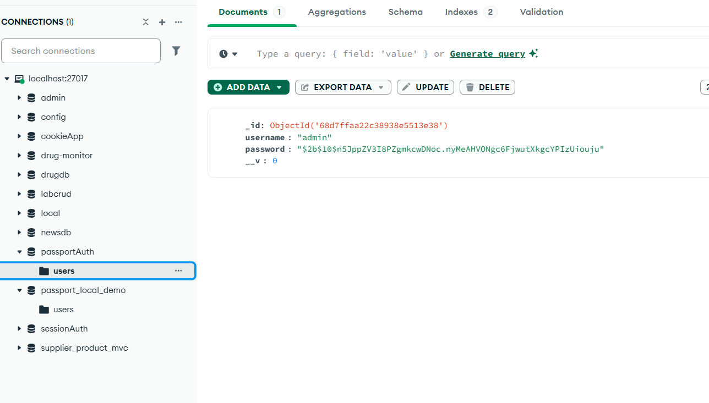
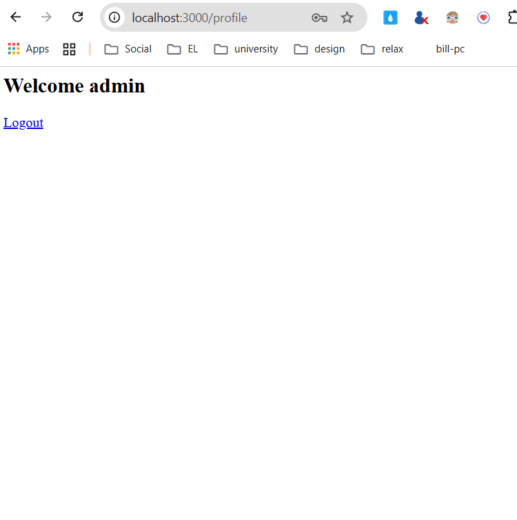

# Simple Auth

## Test với Postman
Run by myself
truy cập vào http://localhost:3000/register để đăng kí  

Check in database xem đã có user mới chưa

sau khi đăng kí xong sẽ nhảy sang trang giao diện login 
lúc này ta nhập vào username và password đã đăng kí trước đó
Hệ thống sẽ tự chuyển hướng đến trang profile và hiển thị dòng chữ welcome "tên bạn đã đăng kí"

Sau khi logout hệ thống tự chuyển hướng về lại trang login 

